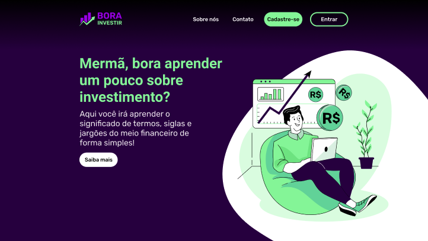
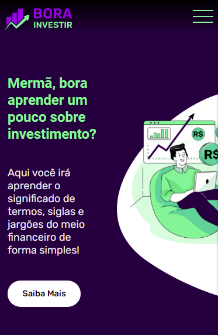
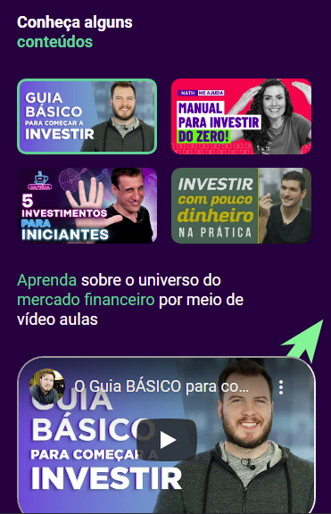
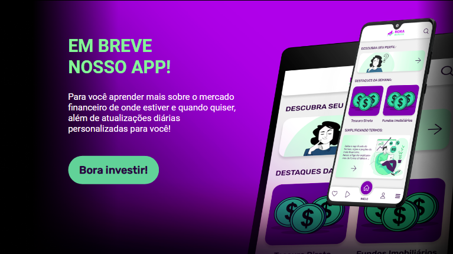
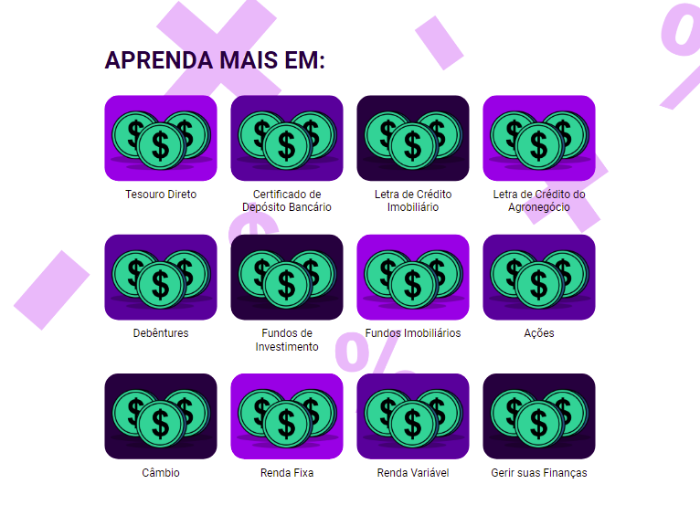
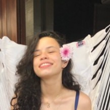
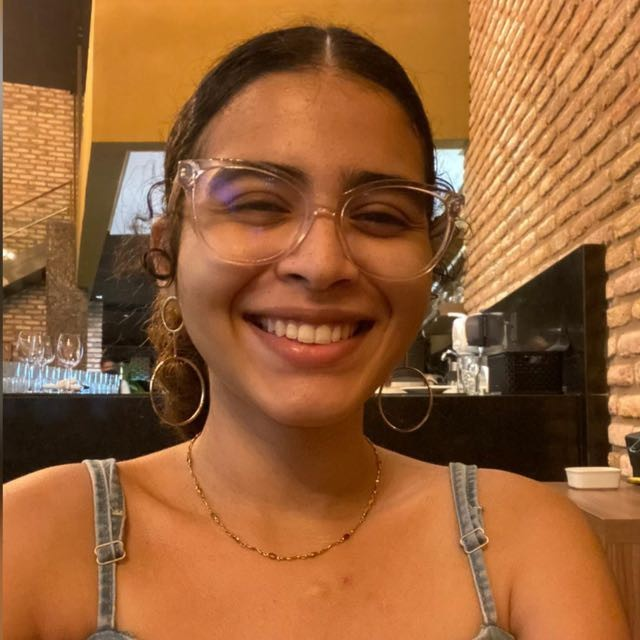

<h4 align="center"> 
	Bora Investir 📊
</h4>

 <a href="#-sobre-o-projeto">Sobre</a> •
 <a href="#-funcionalidades">Funcionalidades</a> •
 <a href="#-layout">Layout</a> •
 <a href="#-tecnologias">Tecnologias</a> •
 <a href="#-autor">Autores</a> • 
 <a href="#user-content--licença">Licença</a>

<h1 align="center">
    
</h1>

## 💻 Sobre o projeto

📊 Bora Investir é uma site que auxilia pessoas que querem começar no ramo de investimentos, fazendo uma análise do perfil de investidor e redirecionando o usuário para conteúdos relacionados ao perfil que se encaixa facilitando sua jornada de aprendizado e iniciação sobre o assunto.

---

## ⚙️ Funcionalidades

- [x] Vídeo aulas.
- [x] Dicas de como investir.
- [x] Textos com assuntos específicos voltados ao investimento.
- [x] Teste de perfil investidor.

### Em breve

- Criação de conteúdos próprios sobre investimentos.
- Cadastro de usuários.
- Aplicativo do Bora Investir.

---

## 🎨 Layout

O layout da aplicação está disponível no Figma:

### Mobile

  

  

### Tablet

  

  

---

## 🛠 Tecnologias

As seguintes ferramentas foram usadas na construção do projeto:

#### **Website**

- **[HTML](https://developer.mozilla.org/pt-BR/docs/Web/HTML)**
- **[CSS](https://developer.mozilla.org/pt-BR/docs/Web/CSS)**
- **[JavaScript](https://developer.mozilla.org/pt-BR/docs/Web/JavaScript)**
- **[ChartJS](https://www.chartjs.org/)**

#### **Utilitários**

- Protótipo: **[Figma](https://www.figma.com/)** → **[Protótipo (Bora Investir)](https://www.figma.com/file/4R8xGkHnpPInxPkigF9N5R/Desafio-5?node-id=0%3A1)**
- Vídeos: **[Youtube](https://www.youtube.com/)**
- Editor: **[Visual Studio Code](https://code.visualstudio.com/)**
- Fontes: **[Roboto](https://fonts.google.com/specimen/Roboto)**,**[Rubik](https://fonts.google.com/specimen/Rubik)**
- Fonte de Dados: **[Anbima](https://www.anbima.com.br/data/files/86/D1/30/40/3E88B710C83266B7882BA2A8/ed03.zip)**
- Google Collab: **[Google Collab](https://colab.research.google.com/drive/1bO78S8FP7N0hYGQlVemkx8jqnL0lhqpZ?usp=sharing)**
- Pandas: **[Pandas](https://pandas.pydata.org/)**
- Seaborn: **[Seaborn](https://seaborn.pydata.org/)**
- Matplotlib: **[Matplotlib](https://matplotlib.org/)**

---

## 🦸 Colaboradores

### ✒️ Designers

<table>
  <tr>
    <td align="center"><a href="https://www.linkedin.com/in/beatriz-brandt-263237224"> <b>Beatriz Brandt</b></a> <a href="https://www.linkedin.com/in/beatriz-brandt-263237224" title="Design">✒️</a></td>
    <td align="center"><a href="https://www.linkedin.com/in/edilana-ribeiro-090414220/"> <b>Edilana Ribeiro</b></a> <a href="https://www.linkedin.com/in/edilana-ribeiro-090414220/" title="Design">✒️</a></td>
    <td align="center"><a href="https://www.linkedin.com/in/maria-silveira-171b3919b/"> <b>Maria Silveira</b></a> <a href="https://www.linkedin.com/in/maria-silveira-171b3919b/" title="Design">✒️</a></td>
    <td align="center"><a href="https://www.linkedin.com/in/karolsoares/"> <b>Karoline Oliveira</b></a> <a href="https://www.linkedin.com/in/karolsoares/" title="Design">✒️</a></td>
  </tr>
</table>

### 📈 Cientistas de Dados

<table>
  <tr>
    <td align="center"><a href="https://www.linkedin.com/in/weyder-freire-7876a81aa/"> <b>Weyder Freire</b></a> <a href="https://www.linkedin.com/in/weyder-freire-7876a81aa/" title="Cientista de Dados">📈</a></td>
    <td align="center"><a href="https://www.linkedin.com/in/wellington-garcia-03a767a7/"> <b> Wellington Garcia </b></a> <a href="https://www.linkedin.com/in/wellington-garcia-03a767a7/" title="Cientista de Dados">📈</a></td>
    <td align="center"><a href="https://www.linkedin.com/in/p217/"> <b>Pedro Lucas</b></a> <a href="https://www.linkedin.com/in/p217/" title="Cientista de Dados">📈</a></td>
  </tr>
</table>

### 👨‍💻 Programadores

<table>
  <tr>
    <td align="center"><a href="https://www.linkedin.com/in/beatriz-costa-218060218/"> <b>Beatriz Costa</b></a> <a href="https://www.linkedin.com/in/beatriz-costa-218060218/" title="Programadora">👨‍💻</a></td>
    <td align="center"><a href="https://www.linkedin.com/in/carlosadrianoss/"> <b>Carlos Adriano</b></a> <a href="https://www.linkedin.com/in/carlosadrianoss/" title="Programador">👨‍💻</a></td>
    <td align="center"><a href="https://www.linkedin.com/in/lucas-gabriel-araujo-ribeiro/"> <b>Lucas Ribeiro</b></a> <a href="https://www.linkedin.com/in/lucas-gabriel-araujo-ribeiro/" title="Programador">👨‍💻</a></td>
    <td align="center"><a href="https://www.linkedin.com/in/mayanesousabarroso/"> <b>Mayane Sousa</b></a> <a href="https://www.linkedin.com/in/mayanesousabarroso/" title="Programadora">👨‍💻</a></td>
    <td align="center"><a href="https://www.linkedin.com/in/ne%C3%ADlton-seguins-bb8786a6/"> <b>Neilton Seguins</b></a> <a href="https://www.linkedin.com/in/ne%C3%ADlton-seguins-bb8786a6/" title="Programador">👨‍💻</a></td>
  </tr>
</table>

---

## 📝 Licença

MIT License.
Ficou interessado em nosso projeto? [Entre em contato!](https://www.linkedin.com/in/ne%C3%ADlton-seguins-bb8786a6/)

---
